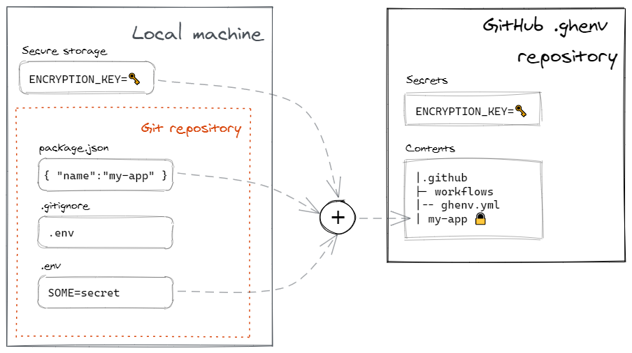
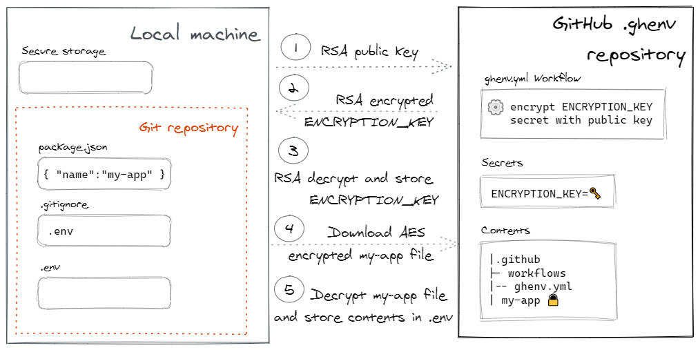

# ghenv

Store `.env` files securely in GitHub and share them across different machines and people.

<!-- toc -->

<!-- tocstop -->

## Features

- Defaults to storing `.env` files but can handle any kind of file securely
- Supports simple repositories and monorepo layouts
- Strong security via symmetric AES and asymmetric RSA encryption

## Setup

- `npm i -g ghenv`
- Create a **private** repository named `.ghenv` in your GitHub account
- [Install](https://github.com/apps/ghenv) the `ghenv` GitHub App on the `.ghenv` repository

## Quick start

- `cd` into the directory containing the `.env` files you want to store.
- `ghenv list` to list which files will be processed
- `ghenv write` to write local `.env` files to the repository
- `ghenv read` to read the files stored in the remote repository and write them to the local file system
- `ghenv view` to view the contents of the remote `.env` files

For the full list of commands and options:

- `ghenv --help`
- `ghenv <command> --help`.

Use `-v` for verbose output or `-vv` for even more verbose output.

## Motivation

`.env` files are a common way to store settings that you don't want to commit to a git repository. Popular packages like [`dotenv`](https://www.npmjs.com/package/dotenv) read those settings and populate the process' environment variables.

If you're working with different machines or needing to share those configurations with other people you end up having to send them in insecure ways and keeping them in sync.

`ghenv` allows to store those settings in encrypted form inside a GitHub repository and accessing them in secure ways.

## Configuration

You can either provide command line arguments to `ghenv` or use a configuration file. Supported file names are:

- `.ghenvrc`
- `.ghenvrc.json`

### `repository`

The name of the repository where to store the encrypted files.

The repository must exist and the `ghenv` GitHub application should have access to it.

It defaults to a repository named `.ghenv` in your personal GitHub account.

It supports the following formats:

- `"repo"` will use the repository called `repo` in your personal user account
- `"account/repo"` will use the repository called `repo` in the account `account`. `account` can be either a user or an organization account. This is useful to share secrets with other people

### `pattern`

The pattern used to match files processed by `ghenv`.

It defaults to `**/.env`, meaning any file named `.env` at any level of the hierarchy, starting from the package root.

It can be changed to support other files besides `.env` files.

### `fileName`

The name of the file to store in the repository.

It defaults to the `name` property as found in the `package.json` file.

## How it works

When you run `ghenv` for the first time, it:

- generates a random AES key and stores it securely on your file system via [conf](https://www.npmjs.com/package/conf). This key will be used to encrypt and decrypt the files stored in the target repository
- stores the key as an [encrypted secret](https://docs.github.com/en/free-pro-team@latest/actions/reference/encrypted-secrets) in the target GitHub repository. GitHub secrets are only available to use within Actions, so it will not be directly accessible via any other means
- creates a GitHub Actions workflow in the target repository to allow downloading the key to other machines or by other people who have access to the repository

When you execute the `write` command, it:

- stores your files in a compressed archive encrypted with the AES key and writes it to the target GitHub repository

When you read the files from a machine where the key is not present it:

- triggers the workflow by sending it the public part of a temporary RSA key pair
- the workflow encrypts the AES key stored in the repository secret with the public part of the RSA key and stores the result in an downloadable artifact
- downloads the artifact and decrypts the encrypted AES key with the private part of the RSA key
- downloads the encrypted files and decrypts them with the AES encryption key
- stores the AES key locally so the next time it won't need to download it again

## License

Licensed under [ISC](LICENSE).

## Credits

Logo courtesy of [Pixabay](https://pixabay.com/images/id-153150/)
